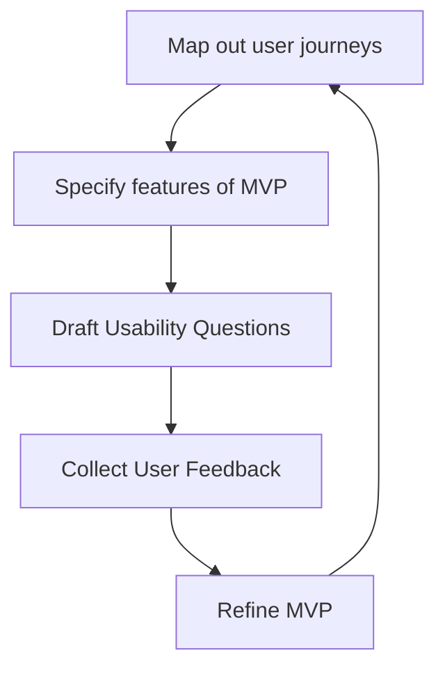

# Process & Guidance for Designing Effective User Research Questions
 
> This document provides a framework for how to formulate the right questions during user research.
> It outlines the general process of conducting usability testing throughout an iterative prototyping cycle.

## Process

### Pre-work with team
> User research is an ongoing process.
> New gaps in understanding emerge during MVP development.
> Still, it is essential to establish a solid foundational understanding of the user at the outset.
Some pre-work should be completed before starting to design usability questions. This involves:
- Identify target users (ideally specific teams at organisations, otherwise generate user personas)
- Conduct initial user research

### Iterative Prototyping Cycle
> Each activity in this list could be a workshop but needs to be at least a conversation.
> The outcome of each step including any decisions made based on the collected information informs the next steps.

### Decisions
> For each stage we define a few questions that should be answered before moving on to the next

#### Initial User research
- What are the primary challenges & pain points of the user in their current workflow 
- How do users currently solve their problems, and what tools or systems do they use? Do they have any work around they currently rely on?
- What are the user expectations? How do users measure the effectiveness or value of a solution?
- Are there any particular requirements of the user's cultural context / sector etc., technical requirements or legacy systems that a new application needs to fit into.
- How do users prefer to provide feedback and engage? Are there any key decision makers that would impact adoption?

#### User Journeys
- What **gaps** in understanding of user behavior currently exist?

#### MVP features
- What **features or aspects** of the MVP are you planning to test?
- What **decisions** will be made from the outcome of the user research?

#### Draft Usability Questions
- What format will these questions be answered, **1:1 interview**, **group brainstorm** or **async questionnaire**?
- Do you need to ask **quantitative** or qualitative **questions**?
- Do you need to **screen** participants or are they **pre-identified**, if so based on what criteria?

## Method: Ethnographic Interview
> **James P. Spradley** The ethnographic interview

- **Pre-test** question to evaluate user's experience level / user profile. 
- **Warm-up** question to put the user into the mood or context of the user experience
- **Test** questions goal is to collect data that explains why users make certain choices while they complete tasks.

### Descriptive questions
- **Purpose:** To gather a broad understanding of the participant's experiences and environment.
- **Examples:** "Can you describe a typical day at your job?" or "What do you usually do on weekends?"
- **Types:**
	- **Grand Tour Questions:** Broad questions asking for a general description (e.g., "Can you describe your neighborhood?")
	- **Mini-Tour Questions:** Focus on a specific event or activity (e.g., "Can you describe how you prepare for a meeting?")
	- **Example Questions:** Asking for specific examples to clarify general statements (e.g., "Can you give an example of a typical family gathering?")
	- **Experience Questions:** Probing past experiences (e.g., "Can you tell me about a time when you felt particularly proud of your work?")
### **Structural Questions**
- **Purpose:** To access the organization of one’s knowledge including the categories and mental models employed during an interaction event. 
- **Examples:** "What are the different types of meetings you attend?" or "What categories of music do you listen to?"
- **Types:**
    - **Domain Questions:** Identify larger categories or domains within which the participant's knowledge is organized (e.g., "What are the different roles in your company?")
    - **Cover Term Questions:** Elicit broad categories and the terms participants use to describe them (e.g., "What are all the terms you use to describe a good meal?")
    - **Included Term Questions:** Drill down into specific elements within a domain (e.g., "What are the different dishes you consider 'comfort food'?")
### **Contrast Questions**

- **Purpose:** To uncover distinctions and differences within different user experiences
- **Examples:** "How is a 'team meeting' different from a 'department meeting'?" or "What is the difference between a good teacher and a great teacher?"
- **Types:**
    - **Contrast Set Questions:** Ask participants to distinguish between items within a set (e.g., "What’s the difference between a casual and a formal dinner?")
    - **Dyadic Contrast Questions:** Compare two elements directly (e.g., "How does a birthday party differ from a holiday celebration?")
    - **Triadic Contrast Questions:** Involve comparing three items to highlight differences (e.g., "Among these three brands of phones, which two are most alike and why?")
### **Evaluative Questions**

- **Purpose:** To understand participants' values, preferences, and judgments.
- **Examples:** "What makes a restaurant a good place to eat?" or "How do you decide what news sources to trust?"

